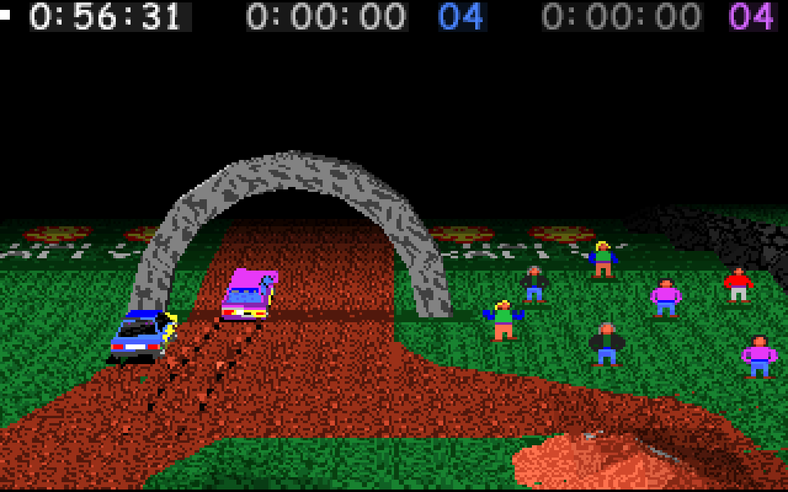

# Replicate Rally-Sport's rendering
This casual repo aims to produce - eventually - a renderer that faithfully replicates the look of the classic mid-90s racing game Rally-Sport.

(Much of the game's appearance is already successfully imitated by [RallySportED-js](https://www.github.com/leikareipa/rallysported-js/), albeit in true 3D rather than by fully embracing Rally-Sport's hybrid rendering approach, which this project aims to do.)

*A screenshot of Rally-Sport.*

## Rally-Sport's render style
Rally-Sport (released in 1996) is a driving game featuring 3D cars racing on pseudo-3D, fixed-perspective tracks. Its hybrid rendering approach led to the game being described at the time as having "vector graphics".

The game's renderer operates on n-sided polygons (as well as lines), rendering the scene from back to front and filling each polygon from bottom to top. An interesting slowed-down video of the game drawing a frame pixel by pixel can be found here: https://www.youtube.com/watch?v=UsvgBjfBCMM.

Cars are the only objects in the game capable of rotating. The rest of the scene is looked at from a fixed angle, the camera unable to turn and allowed only to glide along in the left/right, forward/backward directions.

This fixed camera perspective allowed the renderer to optimize out 'proper' perspective calculation: there's instead a fixed vanishing point at the top center of the screen, with no perspective skew present at the edges of the screen.

Texture-mapping is in most cases done in screen-space coordinates, resulting in fairly distinct geometry-dependent texture warping.
